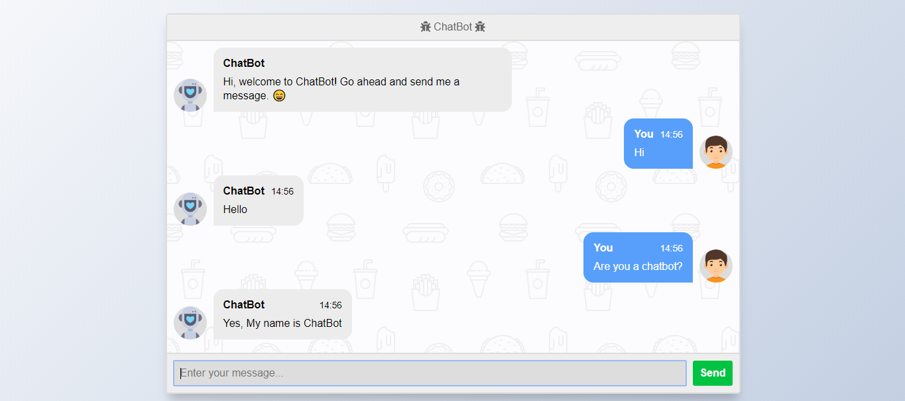
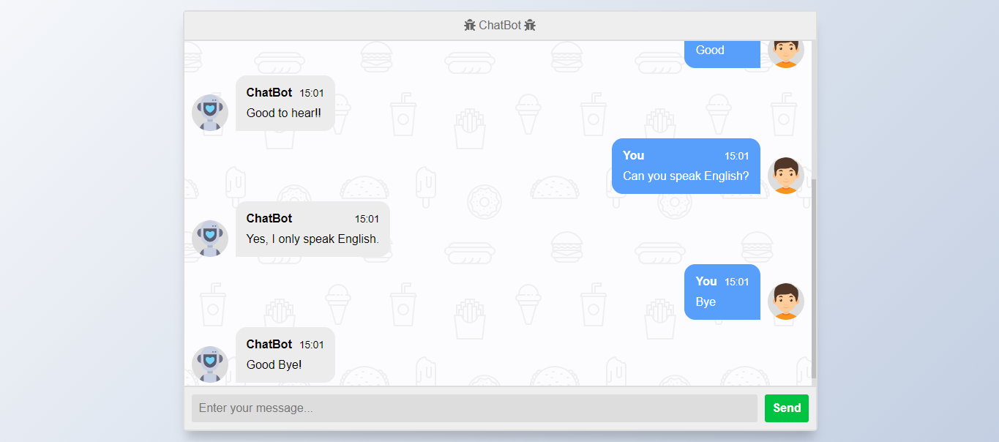

# ChatBot💬 WebApp in Python using Flask
ChatBot is a machine-learning based conversational dialog engine build in Python which makes it possible to generate responses based on collections of known conversations. The language independent design of ChatBot allows it to be trained to speak any language.

The idea of this project was not to create some chatbot with exceptional cognitive skills but just to utilise and test my Python skills.This was one of my projects, created when I just stepped into the world of NLP and I thought of creating a simple chatbot just to make use of my newly acquired knowledge.

## Installation:-

`pip install Flask`

`pip install chatterbot`

`pip install chatterbot-corpus`

## To run in Anaconda:-
### Installing chatterbot in conda environment using Python 3.7
Create new conda environment with Python 3.7

`conda create --name chatterbot_example python=3.7`
### Activate the environment:
`conda activate chatterbot_example`
### Install chatterbot and chatterbot-corpus inside the environment:
`pip install chatterbot`
`pip install chatterbot-corpus`
`pip install Flask`

## Run the file:-
`python app.py`

## Screenshots

## Notes:- 
- **This is just basic chatbot, you can improve chatbot learning. Read [documentation](https://pypi.org/project/ChatterBot/)**
- **For better Chatbot development you can use Dialogflow.**
- **Even you can do better chatbot development with this strategy also. You just need to train a NLP model in better way.**

## Just follow☝️ me and Star⭐ my repository 
